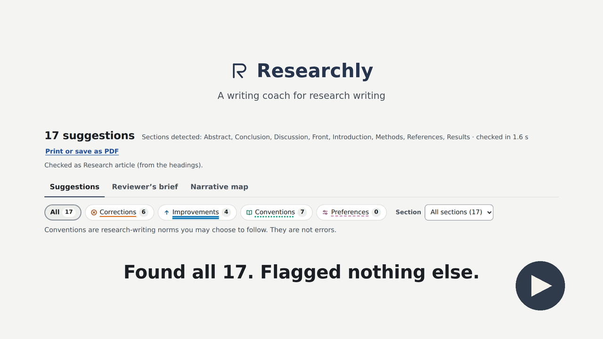

# Researchly

A writing coach for research writing. It checks a draft the way a careful
reader would, explains every point, says where the advice comes from, and
leaves every change to you. It never writes for you.

Try it at **[researchly-chi.vercel.app](https://researchly-chi.vercel.app)**,
on your own draft or on the made-up demo paper.

[](media/researchly-video.mp4?raw=true)

*Researchly in 80 seconds (click to play). The paper in it is the
made-up demo paper in `demo/`, with 17 mistakes planted on purpose. The
narration is a synthetic voice (Kokoro, an open-source text-to-speech
model).*

## Why

You spend months on a manuscript, alone or with a team, and send it for
peer review. The decision comes back: one reviewer lists your grammar
mistakes, another says a key section is hard to follow. Neither comment is
about your science, and both cost you a round of revision.

Researchly does not take the reviewer's place. Reviewers still judge the
science: the question, the design, whether the results hold up. Researchly
is not a domain expert. It reads your draft before they do and helps you
present the work clearly, so reviewers can spend their time on your
science rather than your sentences. Grammar checkers stop at the sentence;
generative tools write the text for you. Researchly reads the whole draft
the way a careful reader would, explains each point, and leaves every
change to you.

- **Same draft, same advice.** With the same settings, the same text gets
  the same feedback: the checks are written rules, not a generative model.
- **A source for every suggestion.** Each flag says what was noticed, why it
  matters in plain words, and where the advice comes from.
- **No cloud or generative AI reads your draft.** The text is processed in
  memory for one request by Researchly's own engine and then dropped. A
  local mode that sends nothing anywhere is available for the Word add-in.
- **It never writes for you.** No drafting, rewriting or paraphrasing, so it
  fits where generative AI is restricted.

## What it does

**Checks on the draft**
- **Suggestions, each explained.** Grammar, spelling, word choice, sentence
  clarity, tone and claims. Each is marked as a Correction, Improvement,
  Convention or Preference, says why in plain words, and names its source.
- **Section-aware advice.** Headings such as Methods and Discussion change
  what is flagged: passive voice is expected in Methods.
- **Whole-document consistency.** Figures and tables cited and in order,
  captions, abbreviations defined once, numbers in the text found in the
  table they cite, equations punctuated as part of a sentence, and terms
  used the same way throughout.
- **Grammar and spelling tiers.** An open-source LanguageTool run alongside
  Researchly's own engine, and a spelling tier with a scientific word list
  and your own dictionary. A tier that is off says so; none fails silently.

**Reading the whole paper** (in Revise mode)
- **Reviewer's brief.** The questions a critical reader asks, each answered
  with what was detected and the sentences it rests on, or marked as not
  assessed.
- **Narrative map.** For each section, the moves a reader expects (for
  example the gap and the aim in an Introduction), marked present, missing
  or out of order, with a question and a frame to fill in. The words stay
  yours.
- **Reporting checklists.** STROBE, CONSORT, PRISMA and EPIFORGE items,
  each "reported" with your sentence or "needs your check". They check
  reporting, never the science.

**Learning as you write**
- **Lessons.** 26 short lessons, each with a before-and-after example and a
  habit to keep, linked from every suggestion.
- **Progress, if you opt in.** Per-rule trends across your checks, stored as
  counts only, never text.

**How you work with it**
- **Draft and Revise.** Draft checks what you have written so far; Revise
  checks the finished manuscript as a whole.
- **Check as.** Research article, thesis chapter, abstract, commentary,
  policy brief, grant proposal or response to reviewers, or a guess from the
  headings that shows what it rests on.
- **Files.** Paste text, or upload Word (.docx), LaTeX (.tex or an Overleaf
  .zip), Markdown, Quarto or R Markdown.
- **Print or save as PDF.** The document with its highlights numbered and
  the suggestions beside them, then the brief and the map, made in your
  browser.
- **Optional account.** Muted rules, your dictionary and your settings
  follow you between the website and Word.

**Where it runs**
- The website, the Word add-in (hosted, or with a local engine that sends
  nothing anywhere), the command line, and a language server for VS Code
  and Positron (preview).

## Four kinds of suggestion

| Kind | Meaning |
|---|---|
| Correction | Likely an error. Worth fixing. |
| Improvement | Correct, but clearer if revised. |
| Convention | A norm of research writing; never presented as an error. |
| Preference | A matter of taste. Hidden unless you switch it on. |

## What is here

| Folder | Contents |
|---|---|
| `packages/core/` | The engine: the `researchly` Python package, its rules, lessons and tests |
| `packages/contract/` | The API contract (OpenAPI and TypeScript types) every surface uses |
| `services/engine/` | The hosted engine service (FastAPI, with a LanguageTool sidecar) |
| `apps/web/` | The website and the Word taskpane (Next.js) |
| `apps/word-addin/` | Word add-in manifests and the local engine server |
| `apps/vscode-extension/` | Language server client for VS Code and Positron |
| `apps/desktop-mac/`, `apps/desktop-win/` | Desktop apps (maintenance only) |
| `supabase/` | Database migrations for optional accounts, and their two-user tests |
| `demo/` | A made-up paper with 17 planted mistakes, as Word, Overleaf and Markdown |
| `ml/realdocs/` | A bench that runs the engine on openly licensed articles |
| `ml/eval/` | Precision from labelled flags |

## Run it

The engine is tested on Python 3.10 and 3.11.

```bash
cd packages/core
pip install -r requirements.txt
python -m spacy download en_core_web_sm
python -m pytest tests/ -q
python -m researchly check path/to/draft.md
```

The grammar tier uses a local LanguageTool, which needs Java. Without Java
that tier reports itself as off rather than failing silently.

The engine service and the website, in two terminals:

```bash
cd services/engine
pip install -r requirements-dev.txt
RESEARCHLY_ENV=development python -m researchly_service   # :8080

cd apps/web
npm ci
NEXT_PUBLIC_ENGINE_URL=http://localhost:8080 npm run dev  # :3000
```

The hosted setup (Cloud Run, Vercel, Supabase) is deployed from the private
repository; `services/engine/README.md` shows how to run the service.

## Where the advice comes from

Every rule names its source on the card. The sources are published works
(for example Gopen and Swan on reader expectations, Swales on research
introductions, Toulmin on argument, Wallace and Wray on critical reading,
and the reporting guidelines), Researchly's own writing guide, and the
maintainer's notes from scientific-writing training. Sources are cited and
paraphrased; no third-party passage is reproduced.

## About this repository

This public repository is generated from a private one. The private
repository also holds evaluation material that cannot be redistributed:
accepted theses used to measure how often the engine flags good writing,
and course notes used to check that no third-party text ships. Those
measurements are reported, but they cannot be reproduced from here. The
real-document bench in `ml/realdocs/` uses openly licensed articles and can.

Comments in the code sometimes mention `CLAUDE.md`, `PLAN.md`,
`ARCHITECTURE.md` or the project log. Those are the private repository's
planning documents and are not published.

## Licence

MIT; see `LICENSE`. The demo paper is made up for this project.

## Contributors

Researchly is created and maintained by [Amriit Mohapatra](https://github.com/amriitmohapatra).

- **Claude (Anthropic)** — implementation and publication contributions, recorded in the repository’s commit history.
- **Codex (OpenAI)** — codebase analysis, reproduced findings, and feature recommendations in the [9 October 2026 review](Codex_Review_9Oct2026.md).

Claude and Codex are AI development assistants; the maintainer directs and reviews their contributions.
